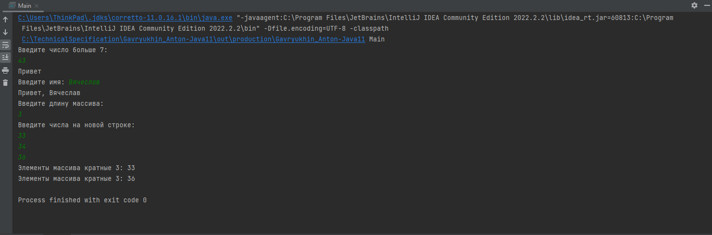
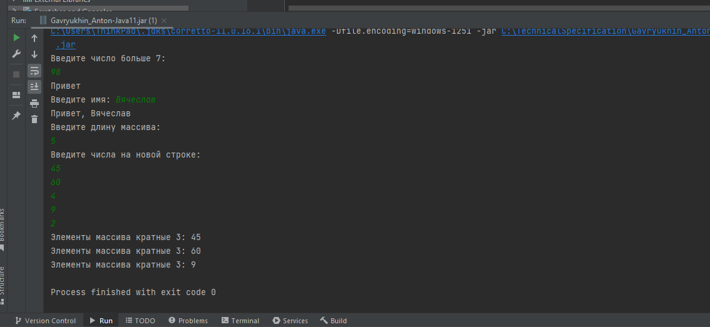

# Gavryukhin_Anton-Java
### Тестовое задание для стажера AQA
Задания "необходимо написать код" выполнено на Java 11 в Intelleji Idea. Все три задания находятся в scr/Main.java.
При запуске последовательно выполняются все 3 задания

**скинштон**

Задание "ответ в текстовой форме":

Дана скобочная последовательность: [((())()(())]]
1. Можно ли считать эту последовательность правильной?  
2. Если ответ на предыдущий вопрос “нет” - то что необходимо в ней изменить, чтоб она стала правильной?

Ответ:
Приведенная последовательность неправильная.

Для приведения к правильной скобочной последовательности необходимо:

уровнять количество скобок соответствующих типов противоположными скобками (для сободной открывающей добавить закрывающую, и на оборот)
или заменить непарные скобки скобками одного типа
- Например:  [ ( (()) () (()) ) ] заменили непарную закрывающую скобку ] скобкой ) (предпоследний символ)

**.jar файл находится в artifacts/Gavryukhin_Anton-Java.jar**

**Запуск .jar файла:** 
* нажав на приложение правой кнопкой мыше и выбрав Run.. 

**скринштон**

